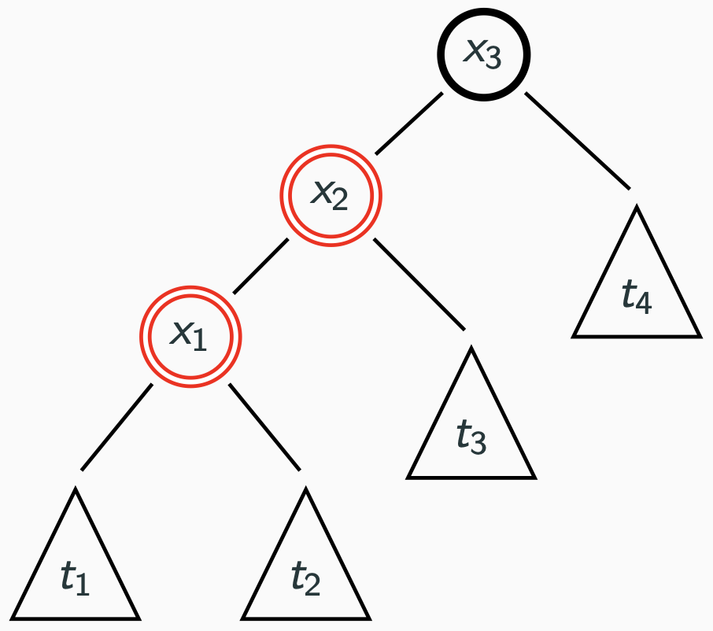
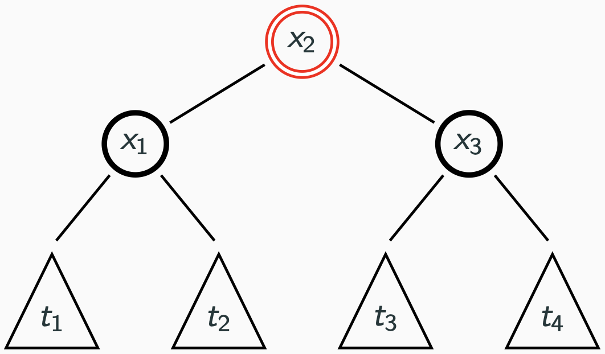
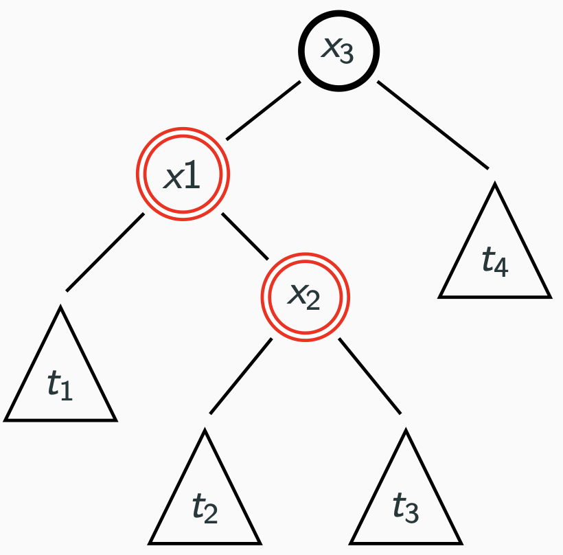

# What properties must a red-black tree satisfy?

A Red-Black Tree is a BST satifying these properties:

1. Every node contains and extra color value: Red or Black
1. The **root** (and leaves) are black
1. There are no consecutive red nodes
1. For each node, every path from it to a leaf has the same **number of black
   nodes**

<!-- Anki tags are represented as using the fictional tag `AnkiTags`. This way
if you wanted to render to HTML or pdf using pandoc. They are basically ignored.
Although, if you are rendering to HTML, you should probably close the tag. I
might change this to be in a comment and then reenable comment parsing in our
programme -->

<AnkiTags this is-how we-have anki tags/>

# If a R-B tree contains $n$ elements, what is the maximum length of a path?

$log(n + 1)$

# What is the running time for searching in a R-B tree?

Therefore the running time for searching is O(log n)

 Describe a first case rotation

{ width=50% }

Assume we have a r-b tree with a red left child followed by a red left
grandchild^[Or a red right child followed by a red right grandchild]:

- **Parent**: $x_{3}$
- **Child**: $x_{2}$
- **Grandchild**: $x_{3}$

{ width=50% }

An easy way to remember this is that all the subtrees numbered 1 to 4 appear in
order in the fixed tree. We put the parent as the right child of the child and
keep it black.  
We then colour the grandchild red and keep it in place. Then we place the
subtrees all as grandchildren in the order that they first appeared.

# Describe a second case rotation

Here we have two reds following each other. The left child and the right
grandchild of the left child. Remember that now we label the grandchild with x2
and the child with x1. To fix this rotation we have to:

- Make the grandchild the parent
- Colour the child black
- Put the parent as the right child and colour it red
- Make all the trees grandchildren in the order they first appeared
