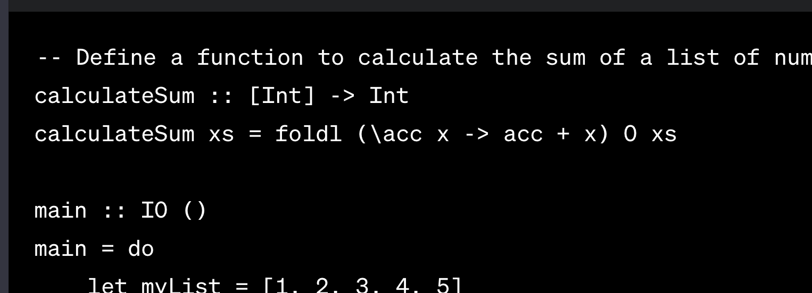

# Image card




# Front of the card can be heading

```javascript
function test() {
  console.log("notice the blank line before this function?");
}
```

This will be the back of the card with some $\sum_{1}^{2}$. It should also
support footnote^[This is a footnote.] and nested lists:

- First item
  - Second level
    - Third level

\begin{equation*}
  \sum_{\text{math blocks should work}}^{11111l}
\end{equation*}

# Card heading becomes the card title (or maybe I'll throw it away)

This is now the front of the card. This is because this section will be be
followed by the markdown syntax for a line break: `. . .`.

. . .

This will be the back of the card. It should support everything else as before.

This will be the back of the card with some $\sum_{1}^{2}$. It should also
support footnote^[This is a footnote.] and nested lists:

- First item
  - Second level
    - Third level

\begin{equation*}
  \sum_{\text{math blocks should work}}^{11111l}
\end{equation*}
